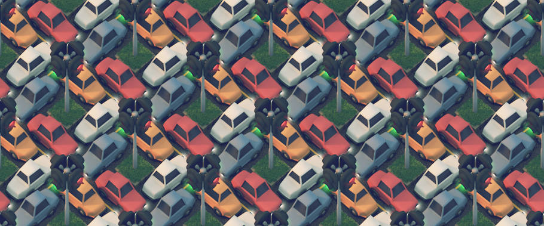
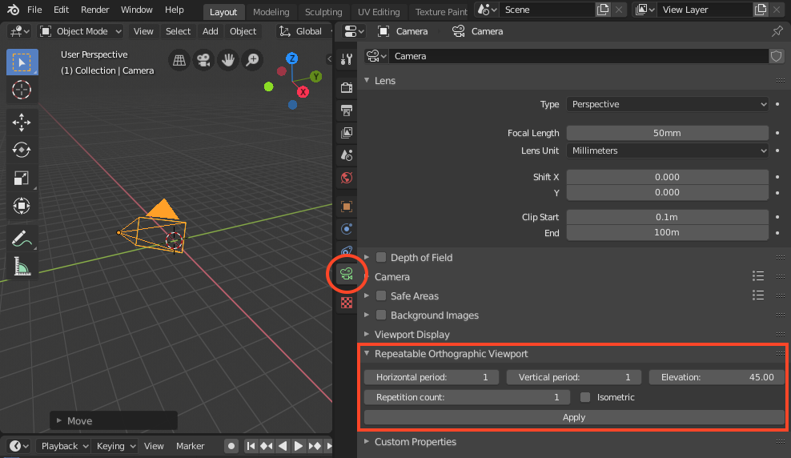
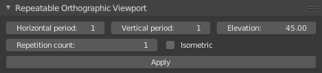
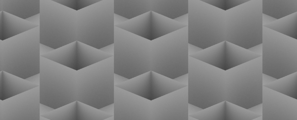
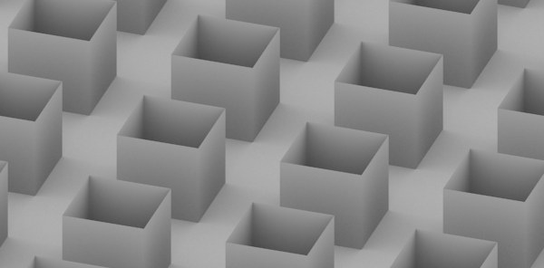
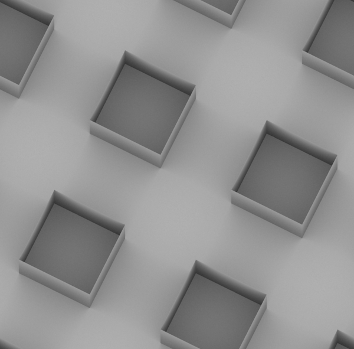
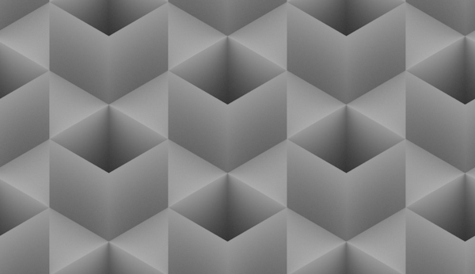

# What it this?

Tilecam is a [Blender](http://blender.org) add-on that makes it easy to render seamlessly repeatable images, like this one



# Installing
1. [Download the latest release](https://github.com/stuffmatic/tilecam/releases), decompress the file and locate the actual add-on file ```src/tilecam.py```.
2. [Install](http://wiki.blender.org/index.php/Doc:2.6/Manual/Extensions/Python/Add-Ons)
3. Check out the [tutorial video](https://vimeo.com/50302862) and [read the user's guide](https://github.com/stuffmatic/tilecam/wiki/User%27s-guide).

# Using Tilecam

The Tilecam panel can be found in the properties editor under the camera tab (which is only visible when a camera is selected). 



Tilecam uses the current horizontal resolution when aligning the camera. If you want to change resolution, just change the horizontal resolution and press **Apply** again. An aligned camera can be moved freely as long as it's not rotated. 

## Parameters


The **horizontal period** determines the number of grid squares in the horizontal direction per tile.

The **vertical period** determines the number of grid squares in the vertical direction per tile.

The **elevation** is the angle between the line of sight and the xy plane. A 90 degree elevation corresponds to a top down view.

The **repetition count** controls the number of tiles in the final image.

Checking the **isometric** box overrides the elevation and horizontal and vertical periods to produce an isometric image, i.e an image where the contour of a cube is a regular hexagon.

Use the **Apply** button to align the currently selected camera.

## Examples

The following examples, using equally spaced cubic boxes, illustrate how the parameters affect the final image.   

__Horizontal period__: 1, __Vertical period__: 1, __Elevation: 24°__, __Repetition count: 2__


__Horizontal period__: 3, __Vertical period__: 1, __Elevation__: 30°, __Repetition count__: 1


__Horizontal period__: 2, __Vertical period__: 1, __Elevation__: 80°, __Repetition count__: 1


__Repetition count__: 2, isometric view

