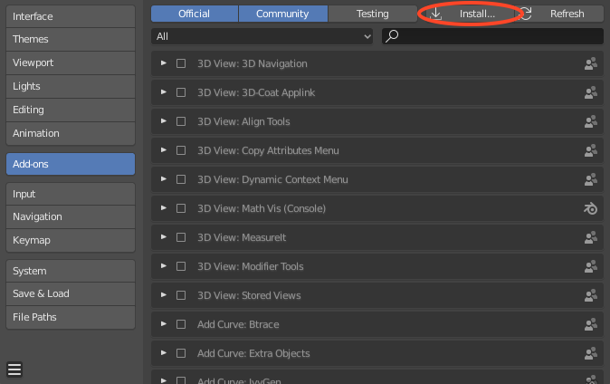
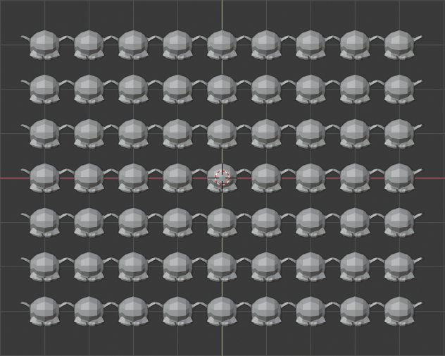
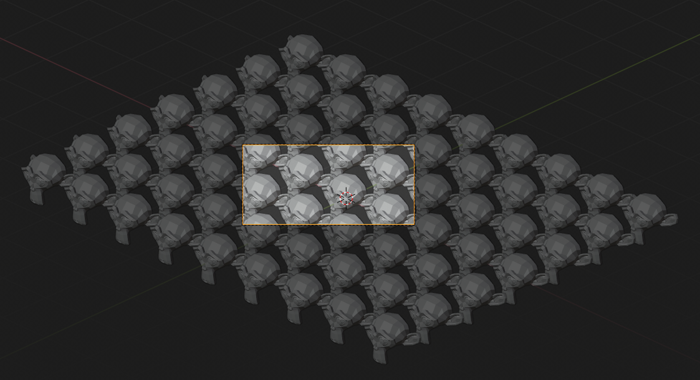

# What it this?

Tilecam is a [Blender](http://blender.org) add-on that makes it easy to render seamlessly repeatable images. To see Tilecam in action, [check out this tutorial video](https://vimeo.com/50302862). 

Here's a repeatable image rendered using tilecam...

...and here's the result of repeating the image above.

# Installing

Download the latest version from [the releases page](https://github.com/stuffmatic/tilecam/releases). Make sure you download the file called `tilecam.py` attached to the release.

Open the preferences window by selecting Preferences from the Edit menu

Select the _Add-ons_ tab and press the _Install_ button

Select the file you downloaded in the first step and press _Install Add-on from file_

Locate Tilecam in the add-on list and enable it by pressing the checkbox.

# Using Tilecam

The Tilecam panel can be found in the properties editor under the camera tab (which is only visible when a camera is selected). 

Given identical objects repeated along the Blender grid floor, one unit apart, tilecam sets up the camera so that the viewport can be seamlessly repeated. For example, this grid of Suzanne meshes...

... looks like this seen through a camera aligned using Tilecam. The viewport can be seamlessly repeated.

If you're using Blender 2.8 or later, it's highly recommended to create a collection containing the geometry you want to repeat and then repeat it using collection instances.

An aligned camera can be moved freely as long as it's not rotated. 

Tilecam uses the current horizontal resolution when aligning the camera. If you want to change resolution, just change the horizontal resolution and press **Apply** again. 

## Parameters

The **horizontal period** determines the number of grid squares in the horizontal direction per tile.

The **vertical period** determines the number of grid squares in the vertical direction per tile.

The **elevation** is the angle between the line of sight and the xy plane. A 90 degree elevation corresponds to a top down view.

The **repetition count** controls the number of tiles in the final image.

Checking the **isometric** box overrides the elevation and horizontal and vertical periods to produce an isometric image, i.e an image where the contour of a cube is a regular hexagon.

Use the **Apply** button to align the currently selected camera.

## Examples

The following examples, using equally spaced cubic boxes, illustrate how the parameters affect the final image.   

__Horizontal period__: 1, __Vertical period__: 1, __Elevation: 24°__, __Repetition count__: 2

__Horizontal period__: 3, __Vertical period__: 1, __Elevation__: 30°, __Repetition count__: 1

__Horizontal period__: 2, __Vertical period__: 1, __Elevation__: 80°, __Repetition count__: 1

__Repetition count__: 2, isometric view

